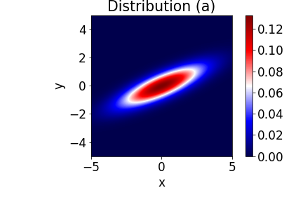
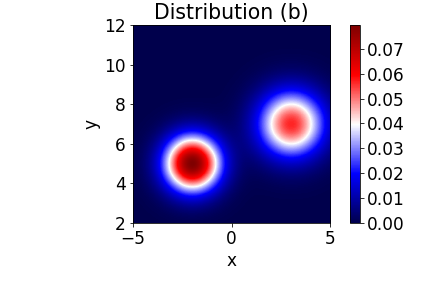
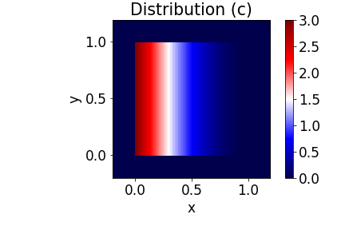

# DSCI 551 Quiz 2

Instructions:

 - For calculation questions, show your work rather than just writing down the final answer. Also, if you're having trouble with the algebra, you can leave your answer in an un-simplified form for partial credit.
 - You are welcome to clone this repo and work locally or edit this file directly in your web browser. If working in the browser, you're advised to commit regularly to avoid losing your work (e.g. by accidentally closing your browser window).
 - Time: 30 minutes.

# Part 1

Let X be the amount of time a student takes to finish a quiz. Let's assume the pdf of X is p(x)=8x, for 0 <= x <= 0.5 hours. 

### 1(a)
rubric={reasoning:2}

What's the probability that a randomly selected student finishes the quiz within 15 minutes (0.25 hours), i.e. P(X <= 0.25)? 

**Answer:**

This is the area of the triangle of width 0.25 and height 2. So the probability is 0.25.

### 1(b)
rubric={reasoning:2}

Is P(X <= 0.25 | X <= 0.4) greater than, less than, or equal to P(X <= 0.25)? Briefly explain your answer. (If you want to answer by calculating the conditional probability, you are welcome to do so, but this is much more work than is needed to answer the question.)

**Answer:**

Greater than. Here are two possible explanations:
 
- Mathematical approach: P(X <= 0.25 | X <= 0.5) = P(X <= 0.25, X <= 0.5)/P(X <= 0.5) = P(X <= 0.25)/P(X <= 0.5) > P(X <= 0.25) since the denominator is less than 1. 
- Intuitive approach: the conditional probability is larger because you've elimiated the possibility of the quiz taking more than 0.4 hours, so it's more likely to finish faster.

### 1(c)
rubric={reasoning:2}

Is the median of X greater than, less than, or equal to 0.25 hours? Briefly explain your answer. (If you want to answer by calculating the median, you are welcome to do so, but this is much more work than is needed to answer the question.)

**Answer:**

Greater than. From part (a) we have that P(X <= 0.25) = 0.25 < 0.5, so the median should be to the right of this point.

### 1(d)
rubric={reasoning:1}

Let F(x) be the cdf of X. What is F(0.5)? No need to explain your answer.

**Answer:**

F(0.5) = 1

# Part 2
rubric={raw:9}

For each of the following bivariate (2-variable) joint distributions, answer the following questions by filling in the table at the bottom of the page. No need to explain your answers.

Questions for each distribution: 

1. Is the correlation coefficient (ρ) positive, negative, or zero?
2. Is E[X] greater, less than, or equal to E[Y]? 
3. Is the distribution a bivariate Gaussian, or not? 

Note: these are not "trick questions" - if the correlation corefficient looks plausibly close to zero, you should answer zero. I wouldn't set it up to look like zero but actually ρ=0.001 or something evil like that. Likewise with E[X]=E[Y] and the distribution being bivariate Gaussian. This doesn't mean the answers are obvious, though - some thinking is required!

Note: in Distribution (c) both X and Y only take values between 0 and 1. In other words, 0 <= X <= 1 and 0 <= Y <= 1.

|                   | ρ>0, ρ<0, or ρ=0? | E[X]>E[Y], E[X]<E[Y], or E[X]=E[Y]?  | Bivariate Gaussian? (yes/no) | 
|-------------------|-------------------|---------|----------|
| Distribution (a)  |   p>0             | E[X]=E[Y] |  yes   |
| Distribution (b)  |   p>0             | E[X]<E[Y] |  no    |
| Distribution (c)  |   p=0             | E[X]<E[Y] |  no    |

