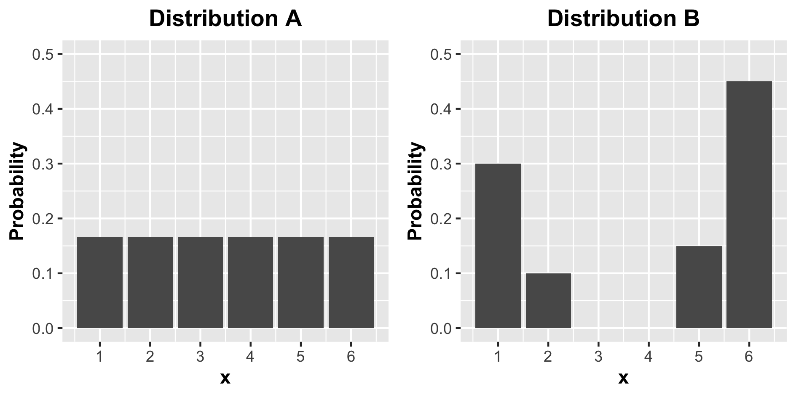
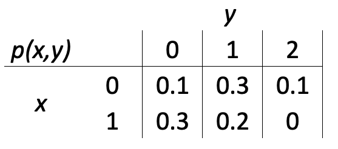

# DSCI 551 Quiz 1

Instructions:

- The quiz has a total of 12 questions.
- All questions are equally weighted.
- Time limit: 30 minutes.
- The quiz is open-book.
- Cell-phones, social media and email applications must not be used during the quiz.

### Q1
<!-- rubric={reasoning:1} -->

For the below distributions, how does the entropy of distribution A compare to distribution B? (less than, equal, or greater)? Why? Answer using one or two brief sentences.



_answer here_

**Solution**: The entropy of Distribution B is less than Distribution A. Distribution A has maximum entropy because the distribution is uniform, i.e., we have the greatest uncertainty in the value of X. The pmf of Distribution B is biased to higher or lower values (in fact, values 3 and 4 are not possible), so we can be more certain of the value of X.

### Q2
<!-- rubric={reasoning:1} -->

How does the variance of distribution A compare to distribution B? (less than, equal, or greater)? Why? Answer using one or two brief sentences.

_answer here_

**Solution**: The variance of Distribution B is greater than Distribution A because it is more spread out from the expected value of the distribution.

### Q3
<!-- rubric={reasoning:1} -->

Is the mean a valid measure of central tendency for a distribution with categorical outcomes? Why or why not? Answer using one or two brief sentences.

_answer here_

**Solution**: No, the mean doesn't make sense for a distribution with categorical outcomes, e.g., what's the mean of the random variable X that describes the weather tomorrow as "sunny", "cloudy", or "rainy". Valid measures of central tendency include the mode or entropy.

### Q4
<!-- rubric={reasoning:1} -->

If you know the variance of a Geometric distribution, is this enough information to isolate the distribution from the family of Geometric distributions? Why or why not? Answer using one or two brief sentences.

_answer here_

**Solution**: Yes, the variance of the geometric distribution is defined as (1-p)/(p^2) such that if we know variance, we know *p*, which is the only parameter needed to isolate a Geometric distribution.

### Q5
<!-- rubric={reasoning:1} -->

If you know the mean and variance of a Binomial distribution, how would you calculate the canonical parameters N and p (number of trials and success probability)? Answer using one or two brief sentences. Note that you don't have to provide any formulas or do any calculations.

_answer here_

**Solution**: You could calculate the canonical parameters using the theoretical equations for the mean and variance of the Binomial distribution (which are in terms of N and p, i.e., mean = np, variance = np(1-p)).

### Q6
<!-- rubric={reasoning:1} -->

In R, you can generate a pseudo-random sample of size 10 with the code rgeom(10, prob = 0.4). How can you modify the code so that executing the code will result in the identical sample? Answer using one or two brief sentences, being sure to clearly indicate the changes that would need to be made.

_answer here_

**Solution**: To produce identical results each time we run the code we would need to fix the random seed using the `set.seed()` function. The resultant code might look like:
```
set.seed(1)
rgeom(10, prob = 0.4)
```

### Q7
<!-- rubric={reasoning:1} -->

Can a random variable have a negative expectation? Very briefly justify your answer.

_answer here_

**Solution**: Yes, if the random variable can assume negative values.

### Q8
<!-- rubric={reasoning:1} -->

For two events A and B, is it possible that P(A|B)=P(A)? Very briefly justify your answer.

_answer here_

**Solution**: Yes if A and B are independent.

### Q9
<!-- rubric={reasoning:1} -->

Suppose X ~ Geometric(p = 0.4), and Y = X^2, so that the relationship between X and Y is deterministic. How would the Pearson's correlation compare to 1 (less than, equal to, or greater than)? How would Kendall's tau compare to 1 (less than, equal to, or greater than)?  Very briefly justify your answer.

_answer here_

**Solution**: For the Geometric series x is non-negative. Pearson's correlation would be positive because as x increases, so too does y, however it would be less than 1 because it measures linear dependence and we have a non-linear relationship here. Kendall's tau on the other hand measures monotonic dependence, and here Y is always increasing as X increases (or vice versa), and we therefore only have concordant pairs such that Kendall's tau would equal 1.

### Q10
<!-- rubric={reasoning:1} -->

What are the odds of rolling a 2 or 4 with a fair, six-sided die?

_answer here_

**Solution**: 2/4

### Q11
<!-- rubric={reasoning:1} -->

The questions below will refer to the following probability distribution.



What is P(Y = 1 | X = 1)?

_answer here_

**Solution**:
    
P(Y=1|X=1) = 0.2/0.5 = 0.4

### Q12
<!-- rubric={reasoning:1} -->

What is the marginal probability P(Y = 1)?

_answer here_

**Solution**: 

P(Y=1) = 0.5