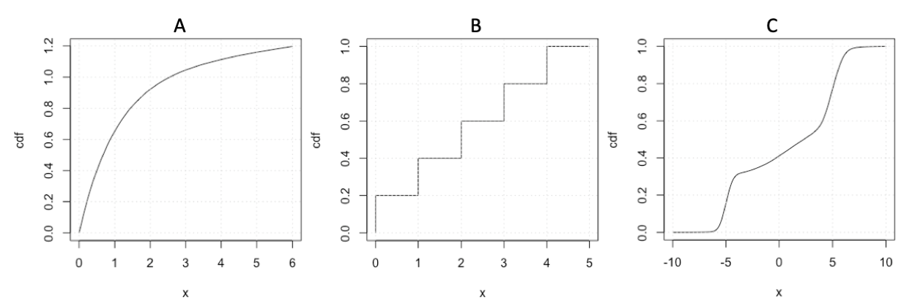
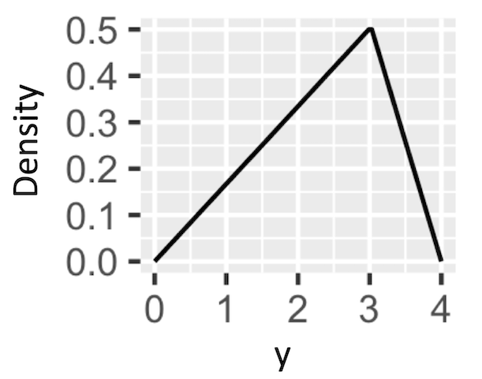
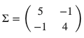
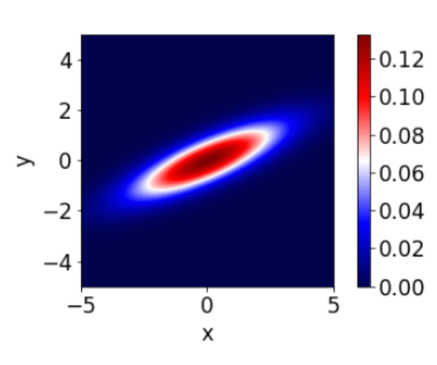

# DSCI 551 Quiz 2

Instructions:

- The quiz has a total of 12 questions.
- All questions are equally weighted.
- Time limit: 30 minutes.
- The quiz is open-book.
- Answer all questions in your own words.
- Cell-phones, social media and email applications must not be used during the quiz.

### Q1
<!-- rubric={reasoning:1} -->

For a continuous random variable, is it a requirement that the probability density always be less than one? Briefly explain your answer.

_answer here_

**Solution**: No the probability density can be greater than one, but the area of the pdf must be equal to one.

### Q2
<!-- rubric={reasoning:1} -->

Is a CDF a valid way to depict the probability distribution of a categorical variable? Briefly explain your answer.

_answer here_

**Solution**: No the CDF doesn’t exist for categorical variables, because there’s no such thing as “less than” or “greater than”.

### Q3
<!-- rubric={reasoning:1} -->

Which of the following is NOT a valid CDF (you may choose more than one)?

_answer here_

**Solution**: A is not a valid cdf because it exceeds a value of 1.

### Q4
<!-- rubric={reasoning:1} -->

What function can be used to map a probability to its equivalent p-quantile?

_answer here_

**Solution**: A quantile function.

### Q5
<!-- rubric={reasoning:1} -->

Is it possible to have a symmetric distribution with non-zero skewness?

_answer here_

**Solution**: No, symmetry implies 0 skewness.

### Q6
<!-- rubric={reasoning:1} -->

Consider the below pdf of Y.

Do you expect that the mean or the median of Y is closer to 0?

_answer here_

**Solution**: The mean is dragged down by the tail of the distribution so it would be less than the median.

### Q7
<!-- rubric={reasoning:1} -->

Let F(y) be the cdf of Y. What is F(3.0)?

_answer here_

**Solution**: It is 0.75, the area of the triangle to the left of 3 (0.5 x 0.5 x 3).

### Q8
<!-- rubric={reasoning:1} -->

Write out the R function to sample 100 random values from the exponential distribution with rate parameter = 5.

_answer here_

**Solution**: rexp(100, rate = 5) or rexp(100, 5)

### Q9
<!-- rubric={reasoning:1} -->

How many parameters are required to characterize a fully general 4-d Gaussian distribution?

_answer here_

**Solution**: 14 parameters are required; 8 for the marginals (mean and variance per marginal) and 6 dependence parameters (pairwise correlations).

### Q10
<!-- rubric={reasoning:1} -->

The following three questions refer to the random variables X and Y which are jointly Gaussian with means of zero and the covariance matrix given below:

What is Cov(X,Y)?

_answer here_

**Solution**: -1

### Q11
<!-- rubric={reasoning:1} -->

Are X and Y from Question 10 independent? Briefly explain your answer.

_answer here_

**Solution**: No, from the covariance matrix we can see that their covariance is  −1 . Since the covariance is not zero, they are not independent.

### Q12
<!-- rubric={reasoning:1} -->

Could the below be an accurate representation of the joint probability of X and Y from Question 10 ?

_answer here_

**Solution**: No, this plot shows positive correlation between X and Y, whereas X and Y have a negative correlation.
